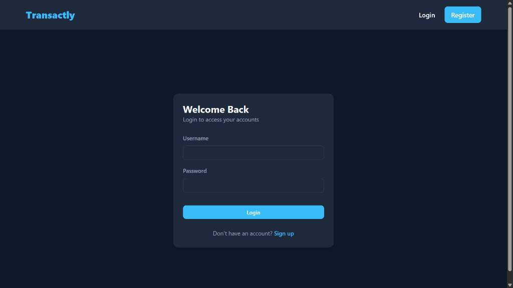
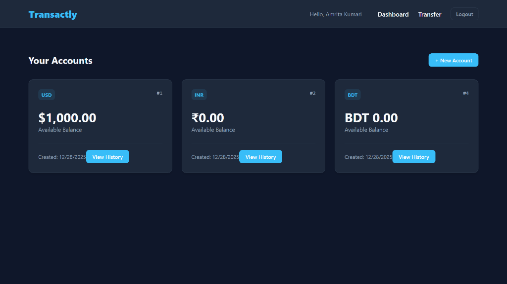
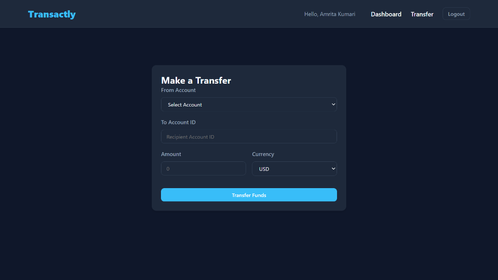
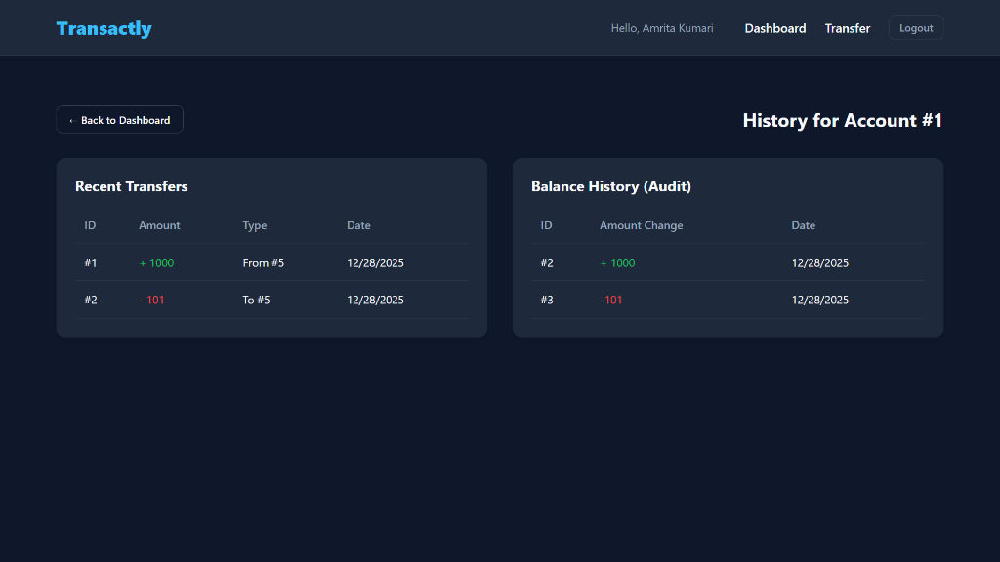

# OrdinaryBank (Transactly)

OrdinaryBank (Transactly) is a robust, full-stack banking application designed to demonstrate secure and efficient financial transaction handling. It features a modern Go backend and a responsive React frontend, allowing users to create accounts, managing funds, and audit transaction histories.

## 📸 Application Screenshots

Explore the user interface and workflow of the application:

### 1. Authentication
Secure login and registration flows to protect user accounts.

| Login Page | Registration Page |
|:---:|:---:|
|  |  |

### 2. Dashboard
A unified view of all user accounts and balances.

<div align="center">
  
</div>

### 3. Transactions
Seamlessly transfer funds between accounts and audit transaction logs.

| Fund Transfer | Transaction History |
|:---:|:---:|
|  |  |

---

## 🚀 Technology Stack

### Backend
- **Language**: Go (Golang) 1.24
- **Framework**: [Gin](https://gin-gonic.com/) (HTTP web framework)
- **Database**: PostgreSQL
- **ORM**: [SQLC](https://sqlc.dev/) (Type-safe SQL compiler)
- **Security**: PASETO tokens for authentication
- **Migrations**: Golang Migrate

### Frontend
- **Framework**: React 18
- **Build Tool**: Vite
- **Routing**: React Router DOM
- **HTTP Client**: Axios
- **Styling**: Modular CSS

### DevOps
- **Containerization**: Docker
- **Orchestration**: Docker Compose

## 🛠️ Prerequisites

Before getting started, ensure you have the following installed:
- [Docker](https://docs.docker.com/get-docker/) & Docker Compose
- [Go](https://go.dev/dl/) 1.24+ (Optional, for local Go development)
- [Node.js](https://nodejs.org/) (Optional, for local Frontend development)

## 🏁 Getting Started

### Method 1: Docker Compose (Recommended)

Run the entire stack (Database, Backend, Frontend) with a single command.

1.  **Clone the repository:**
    ```bash
    git clone https://github.com/nilesh0729/Transactly.git
    cd Transactly
    ```

2.  **Set up Environment Variables:**
    ```bash
    cp .env.example .env
    ```
    *Modify `.env` if you need custom database credentials or secrets.*

3.  **Start the Application:**
    ```bash
    docker-compose up --build
    ```

4.  **Access the App:**
    - **Frontend**: http://localhost:80
    - **Backend API**: http://localhost:8080

### Method 2: Manual Setup

<details>
<summary>Click to expand manual setup instructions</summary>

#### 1. Database Setup
```bash
# Start Postgres
make Container

# Create Database
make Createdb

# Run Migrations
make MigrateUp
```

#### 2. Backend Setup
```bash
# Install dependencies
go mod tidy

# Run server
make Server
```

#### 3. Frontend Setup
```bash
cd frontend
npm install
npm run dev
```
</details>

## ⚙️ Configuration

Key environment variables in `.env`:

| Variable | Description |
| :--- | :--- |
| `DB_SOURCE` | PostgreSQL connection string |
| `SERVER_ADDRESS` | API Listen Address (e.g., `0.0.0.0:8080`) |
| `TOKEN_SYMMETRIC_KEY` | Secret key for signing tokens (Must be 32 chars) |

## 🧪 Development Commands

Common `Makefile` commands:

- `make Test`: Run backend tests
- `make Sqlc`: Regenerate SQLC code
- `make Mock`: Generate mocks
- `make MigrateUp`: Apply database migrations
